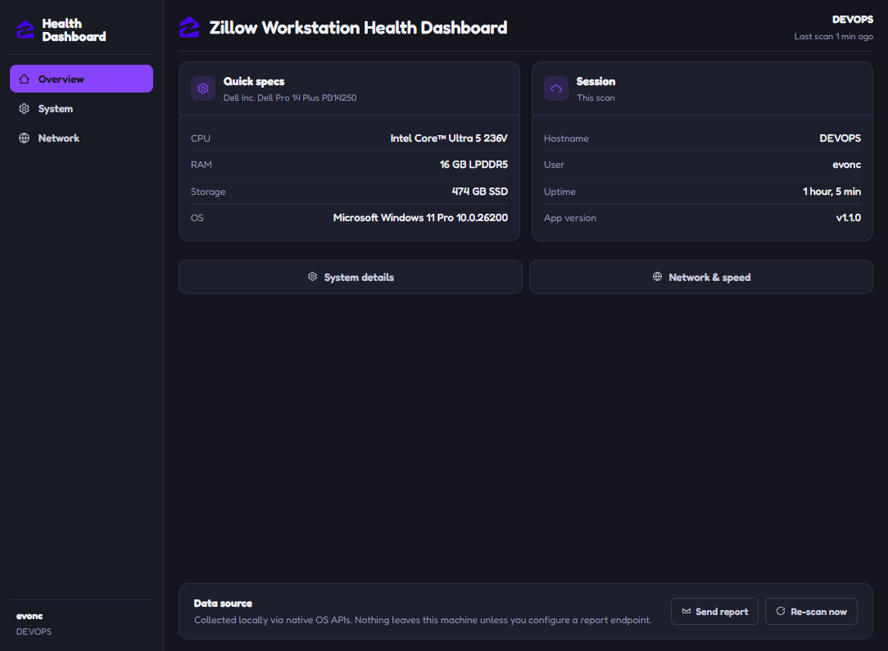
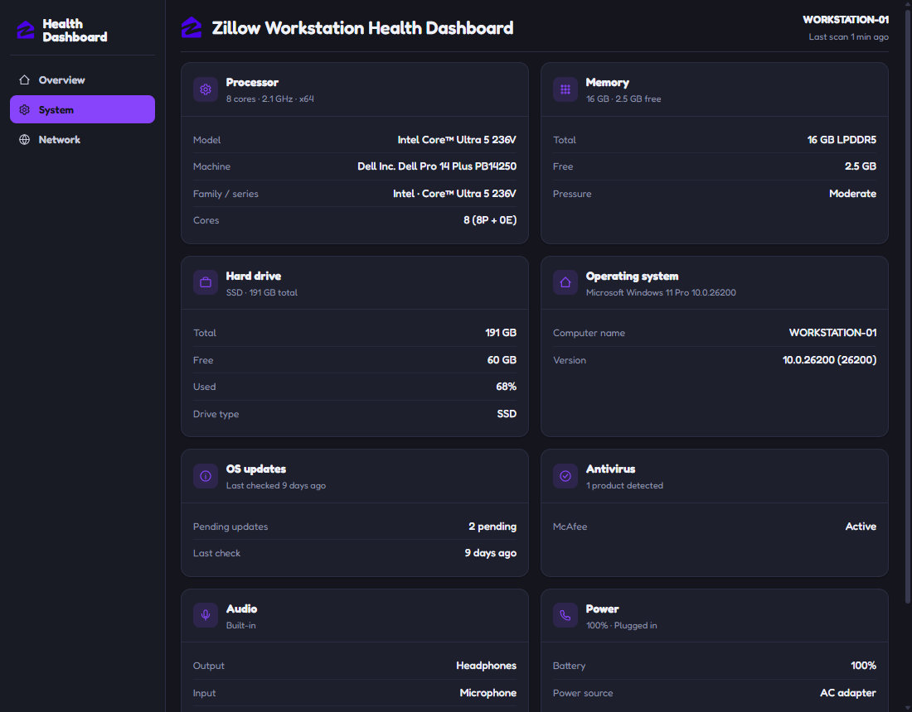
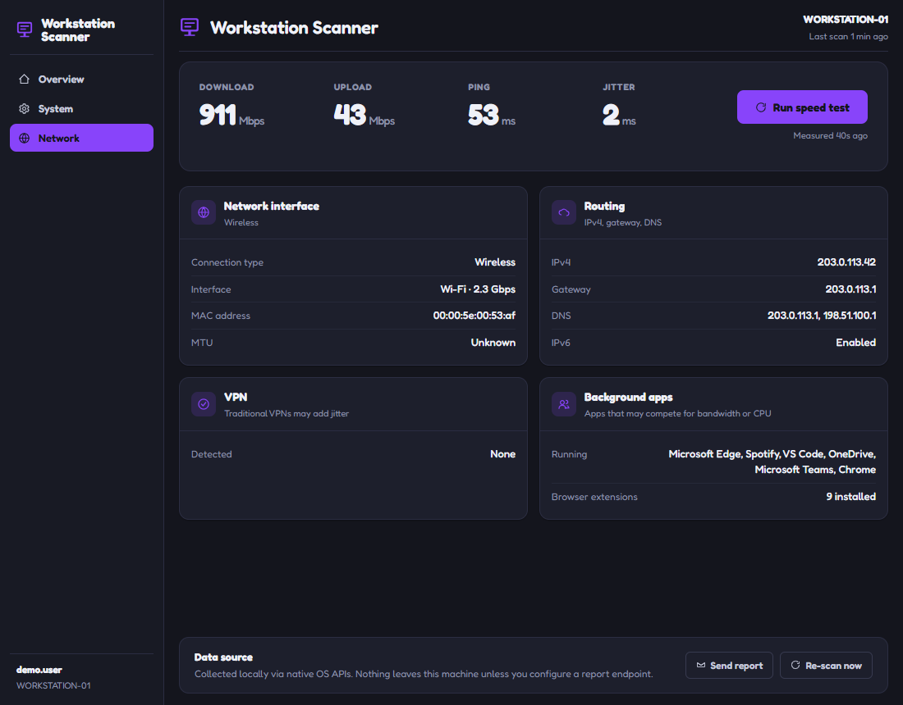

# Workstation Scanner

This application reports on a computer's health —
CPU, RAM, disk, OS, network, antivirus, and audio — and runs a real network
speed test. Everything is collected from real local system data (via
[`systeminformation`](https://github.com/sebhildebrandt/systeminformation)
and native OS APIs) and shown as plain facts across three tabs —
**Overview, System, and Network**.

---

## Screenshots

### Overview



### System and Network

| System | Network |
| --- | --- |
| [](docs/screenshots/system.png) | [](docs/screenshots/network.png) |

> Screenshots are generated from the running app by `npm run screenshots`.
> Network identifiers are replaced with documentation-range placeholders
> (RFC 5737 / RFC 7042) before capture.

---

## Installing

Each CI run on `main`, and each manual run, builds an installer for Windows,
macOS and Linux. Open the run on the repository's **Actions** tab and download
the file for your system from **Artifacts**. It arrives as a `.zip`; unzip it
to get the installer.

The installers are not code-signed yet, so the first time you open the app
your operating system warns that it can't verify it. The steps below get past
that warning once; after that the app opens normally. Only do this for a copy
you downloaded from this repository.

### Windows

1. Run `Workstation Scanner Setup <version>.exe`.
2. If Windows shows **Windows protected your PC**, select **More info**, then
   **Run anyway**.
3. The installer sets the app up for your user account, without asking for
   administrator rights, and opens it. After that, find it in the Start menu
   as **Workstation Scanner**.

To uninstall, open **Settings → Apps → Installed apps**, find Workstation
Scanner, and select **Uninstall**.

### macOS

1. Pick the disk image for your Mac: `Workstation Scanner-<version>-arm64.dmg`
   for Apple silicon (M1 or later), or `Workstation Scanner-<version>.dmg` for
   Intel. **Apple menu → About This Mac** shows which chip you have.
2. Open the disk image and drag **Workstation Scanner** into **Applications**.
3. Open the app from Applications. macOS says it could not verify the app;
   select **Done**.
4. Open **System Settings → Privacy & Security**, scroll down to the message
   about Workstation Scanner, and select **Open Anyway**. Confirm with your
   password or Touch ID, then select **Open**.

### Linux

**Ubuntu and Debian:** install the `.deb` package.

```bash
sudo apt install ./workstation-scanner_<version>_amd64.deb
```

Then open **Workstation Scanner** from your applications menu, or run
`workstation-scanner` in a terminal. To uninstall, run
`sudo apt remove workstation-scanner`.

Use the `.deb` on Ubuntu 23.10 and later: the AppImage does not start there.
Ubuntu restricts the sandbox the app runs in, and the package installs an
AppArmor profile that allows it (`/etc/apparmor.d/workstation-scanner`,
removed again when you uninstall).

**Other distributions:** use the AppImage.

1. Make it executable and run it:

   ```bash
   chmod +x "Workstation Scanner-<version>.AppImage"
   ./"Workstation Scanner-<version>.AppImage"
   ```

   Or, in your file manager, open the file's **Properties**, turn on
   **Allow executing file as program**, and double-click it.
2. If it reports that FUSE is missing, install your distribution's FUSE 2
   package (`fuse` or `fuse-libs` on Fedora, `fuse2` on Arch) and try again.

---

## Emailing reports

**Send report** asks for an email address and emails the report there: a
readable summary, with the full report attached as JSON. The app sends it to a
small report service, [`server/report-mailer`](server/report-mailer/), which
sends the email. The report includes the computer's name, the username, and its
IP and MAC addresses, and the dialog says so.

A build only emails reports once the service is deployed and its URL is in
`package.json` (`workstationScanner.reportUrl`); until then the dialog says
emailing isn't set up. See [`server/report-mailer/README.md`](server/report-mailer/README.md)
to deploy it. `WHD_REPORT_URL` overrides the built-in URL.

---

## Running from source

```bash
npm install
npm start
```

`npm start` compiles the renderer first (`npm run build`): it vendors React's
production build into `app/renderer/dist/vendor` and precompiles the JSX with
esbuild. Nothing is fetched from a CDN at runtime, so the app launches on a
machine with no working network — which is exactly the machine you are most
likely to be diagnosing.

On launch the dashboard appears as soon as the system scan lands (about a
second or two). The network speed test runs in the background and fills in the
Network tab when it finishes; the slower OS-update, SSD and process scans do
the same.

---

## What it checks

| Area                                                  | Source                                        |
| ----------------------------------------------------- | --------------------------------------------- |
| CPU, RAM + pressure, disk, OS, power, uptime          | `systeminformation` + Node `os`               |
| Displays: resolution, refresh rate, external monitors | `systeminformation` (fetched after first paint) |
| Antivirus                                             | Windows Security Center / macOS app bundles / Linux install markers + process check |
| VPN                                                   | active tunnel-interface scan                  |
| DNS                                                   | Node `dns`, or `resolvectl` behind systemd-resolved |
| Background apps, browser-extension count              | process/file scans (fetched after first paint) |
| Selected audio devices                                | Windows MMDevice API / PulseAudio-PipeWire (`pactl`) |
| OS pending updates, SSD flag                          | Windows Update / apt / dnf, from cached metadata (fetched after first paint) |
| Network speed (download/upload/ping/jitter)           | Cloudflare speed test, on launch; each run stops at 250 MB down / 100 MB up, so a fast link doesn't burn a metered plan |

---

## API tests (Postman)

[`postman/`](postman/) holds a Postman collection for the Cloudflare endpoints
the speed test measures against, with test scripts on every request —
including one that steps down through the app's download sizes when Cloudflare
rate-limits a large download (HTTP 429). Import it into Postman, or run it from the command
line:

```bash
npm run test:postman
```

See [`postman/README.md`](postman/README.md) for what each request checks.

---

## Project structure

```
Workstation-Scanner/
├── main.js                  # Electron main process (window + IPC)
├── build.js                 # renderer build: vendors React, bundles the JSX
├── build/                   # app icons (`npm run icons`), .deb install scripts
├── docs/screenshots/        # README images (generated by `npm run screenshots`)
├── postman/                 # Postman collection for the speed-test endpoints
├── tools/                   # icon, screenshot and smoke-test tools
├── server/report-mailer/    # Cloudflare Worker that emails reports (deployed separately)
└── app/
    ├── main/system-facts.js # Collects real workstation facts → FACTS object
    ├── main/report.js        # Sends the report to be emailed (https only)
    ├── preload.js            # contextBridge → window.whd
    ├── INTEGRATION.md        # Architecture notes + how to extend it
    └── renderer/              # React UI (loaded by main.js)
        ├── index.html
        ├── helper-app.jsx    # 3-screen dashboard (entry point)
        ├── speedtest.js      # Cloudflare speed test
        ├── report-dialog.jsx # "Email this report" dialog
        ├── report-messages.js # Text for a failed report, address check
        ├── react-globals.js  # React/ReactDOM from the vendored UMD builds
        ├── icons.jsx, toast.jsx
        ├── assets/            # design tokens + brand font
        └── dist/              # build output (git-ignored, made by build.js)
```

`build.js` at the repo root produces `app/renderer/dist`. Run it with
`npm run build`; `npm start` and `npm run dist` do it for you.

Unit tests sit beside the code they cover (`*.test.js`) and run with
`npm test` (Node's built-in `node --test`). They stub the network and run the
speed test on a fake clock, so they need no connection and take under a second.

---

## Notes

- React ships with the app and the JSX is precompiled, so `index.html` enforces
  a strict CSP with no remote origins and no `unsafe-eval`. The one network
  allowance is `connect-src https://speed.cloudflare.com` for the speed test.
- The UI is dark only, by design — there is no theme switch and no second
  palette to keep in sync. Every surface and text colour resolves from the
  tokens in `app/renderer/assets/theme.css`; no component names a hex directly.
- The app icon is generated from the brand mark by `npm run icons`, which emits
  `build/icon.ico` (7 sizes), `build/icon.png` and a Linux PNG set.
- The installers are not code-signed, which is why each OS warns on first
  open (see [Installing](#installing)). Signing the macOS build with an Apple
  Developer ID and notarizing it, and signing the Windows installer with an
  Authenticode certificate, would remove those warnings.
